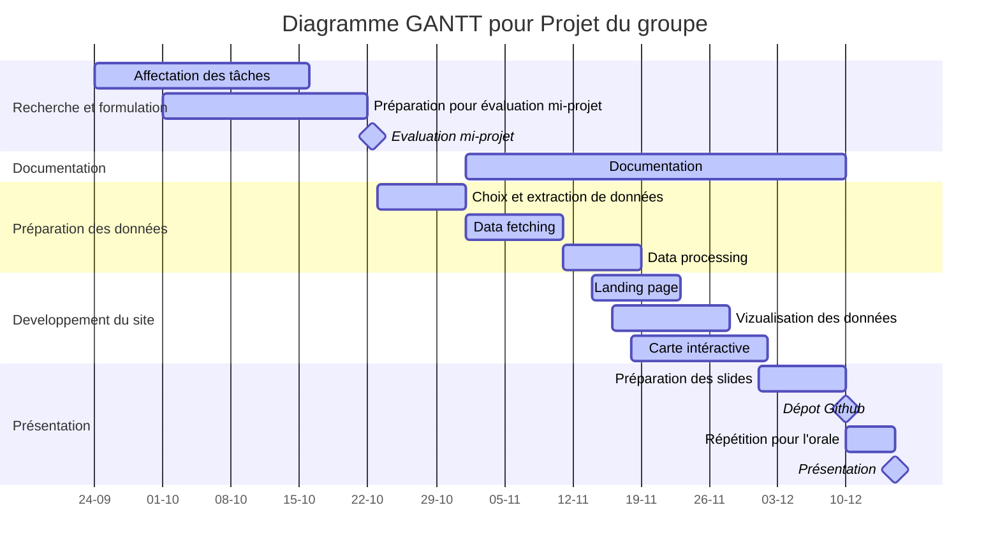

#  Projet de développemet logiciel sur la pollution en Occitanie 

## 1. Formulation du problème et proposition du :
La pollution de l'air est devenue une préoccupation majeure dans notre société, et notre objectif dans ce projet est de fournir des informations exploitables pour aider à créer un environnement plus propre et plus sain pour nos communautés  dans la région de l'occitanie. Grâce à notre approche axée sur les données, nous vous offrons un aperçu de la situation actuelle de la pollution dans la région Occitanie, des analyses en temps réel, et une carte interactive de la région qui résume l'état actuelle de la pollution.

## 2. Architecture du site :
1. **Source des données** : On utilisera L'API publique du site [data_atmo-occitanie](https://data-atmo-occitanie.opendata.arcgis.com/) pour récuperer les données du pollution à la region de l'occitanie.
2. **Data Fetching et processing** : on va créer un script python pour récupérer et manipuler les données.
3. **Vizualisation** : On va visualiser les données dans une page et une autre page pour la création d'une carte interactive qui résume et décrire l'état  de la pollution à la région de l'occitanie.
4. **Création du site** : on utilisera Quarto pour créer aussi une Landing page qui contient blocs vers les deux pages cités dans le point précédent. 
5. **Déploiement du site** : on va déploier le site en utilisant Github Pages.

6. **Documentation** : on va créer une documentation claire pour notre projet.  

voici une réprésenetation exemplaire de notre répertoire :

```
projet_pollution_Occitanie/
    ├── data_fetching/
    │   ├── data_fetcher.py
    ├── data_processing/
    │   ├── data_processor.py
    ├── visualization/
    │   ├── map_visualization.py
    │   ├── graph_visualization.py
    ├── website/
    │   ├── Quarto notebook
    ├── .github/
    │   ├── workflows/
    │   │   ├── github_actions_workflow.yml
    ├── README.md
    ├── requirements.txt
```

## 3. Choix des données: 


##  4. Choix des packages pour le projet :
Pour réaliser notre projet, nous allons utilier les packages suivant (avec leurs versions d'emploie) : 
1. **Requests (2.31.0)** : on utilise ce package pour récupurer les donnés a partir du L'API publique du site data_atmo-occitanie.
2. **Pandas (2.1.1)** : tout simplement pour faire des manipulations des données par exemple si on a des données 
3. **Matplotlib (3.8.0)** :  pour visualiser les données et créer des graphes utiles pour décrire et expliquer notre solution pour le problème.
4. **plotly (5.17.0)** : Aussi pour la visualisation et l'interactivité des données en temps réelles qui vient du l'API.
5. **Quarto (0.1.0)** : prend charges et rendre le  code Python exécutable dans Markdwon, cela nous permet de créer, developper et déployer notre notre site web.
6. **Sphinx (7.2.6)** : C'est une extension de reStructeredText qui est assez similaire à la format de Markdown, on l'utilisera pour créer et génerer documentation automatique des nouveaux classe qui vont être créer pour le __**data fetching**__ dans notre projet.
7. **GeoPandas (0.14.0) __*ou*__ Mapbox GL** : pour créer la carte interactive on va choisir l'un des deux packages.
8. **Pytest(7.3.0)** : ce package nous aidera à faire des tests dans notre code et facilite le développement et l'amélioration du notre code.
9. **Github Actions Workflow et Github Pages** :
10. **HTML et CSS __*et*__ / __*ou*__ Javascript** : ces derniers sont indispensable pour créer un site web ou HTML et CSS sont utilisé pour metter en forme notre site, et peut être on va utiliser javascript pour avoir plus de flexibilité dans l'interactivité dynamique sur le site web.


## 4. Photos qui résume le résultat souhaité : 


## 5. Affectation des tâches:
  Voici le diagramme GANNT pour notre projet:


