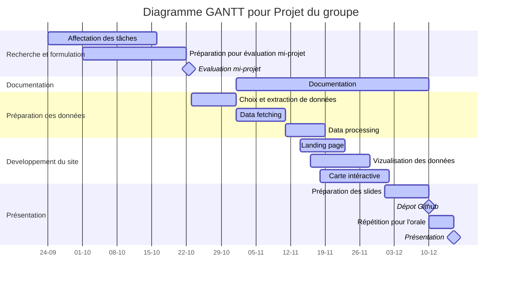

#  Projet de développemet logiciel sur la pollution en Occitanie 

## 1. Formulation du problème :
La pollution de l'air est devenue une préoccupation majeure dans notre société. Notre objectif est d'exploiter des données mises à disposition par l'API afin de fournir des informations aux utilisateurs de notre site web de manière interactive, en offrant un aperçu de la situation actuelle de la pollution en Occitanie. À l'aide notamment, d'analyse en temps réel et d'une carte interactive qui résume l'état de la pollution dans la région.

## 2. Architecture du site :
1. **Source des données** : On utilisera L'API publique du site [data_atmo-occitanie](https://data-atmo-occitanie.opendata.arcgis.com/) pour récupérer les données de la pollution de la region Occitanie;
2. **Data Fetching et processing** : On va créer un script python pour récupérer et manipuler les données;
3. **Visualisation** : On va visualiser les données dans une page et une autre page sera dédiée à la création d'une carte interactive qui résume et décrit l'état de la pollution en Occitanie;
4. **Création du site** : On utilisera Quarto pour créer une Landing page qui contient blocs vers les deux pages cités dans le point précédent; 
5. **Déploiement du site** : On va déployer le site en utilisant Github Pages;

6. **Documentation** : On va créer une documentation claire pour notre projet.  

Voici un exemple représentatif de notre répertoire :

```
projet_pollution_Occitanie/
    ├── data_fetching/
    │   ├── data_fetcher.py
    ├── data_processing/
    │   ├── data_processor.py
    ├── visualization/
    │   ├── map_visualization.py
    │   ├── graph_visualization.py
    ├── website/
    │   ├── Quarto notebook
    ├── .github/
    │   ├── workflows/
    │   │   ├── github_actions_workflow.yml
    ├── README.md
    ├── requirements.txt
```

## 3. Choix des données: 


##  4. Choix des packages pour le projet :
Pour réaliser notre projet, nous allons utiliser les packages suivant (avec leurs versions d'emplois) : 
1. **Requests (2.31.0)** : On utilisera ce package pour récupérer les données à partir de l'API publique du site data_atmo-occitanie;
2. **Pandas (2.1.1)** : Pour manipuler des données; 
3. **Matplotlib (3.8.0)** : Pour visualiser les données et créer des graphes utiles pour décrire et expliquer la situation dans la région Occitanie;
4. **plotly (5.17.0)** : Pour la visualisation et l'interactivité des données en temps réelles qui viennent de l'API;
5. **Quarto (0.1.0)** : Prends en charge et rend le  code Python exécutable dans Markdown, cela nous permettra de créer, développer et déployer notre site web;
6. **Sphinx (7.2.6)** : C'est une extension de restructeredText qui est assez similaire au format de Markdown, on l'utilisera pour créer et générer la documentation automatique des nouvelles classes qui vont être créés pour le __**data fetching**__ de notre projet;
7. **GeoPandas (0.14.0) __*ou*__ Mapbox GL** : Pour créer la carte interactive, on va choisir l'un des deux packages;
8. **Pytest(7.3.0)** : Ce package nous aidera à faire des tests de notre code et facilitera le développement et l'amélioration de celui-ci;
9. **Github Actions Workflow et Github Pages** :
10. **HTML et CSS __*et*__ / __*ou*__ Javascript** : Ces derniers sont indispensables pour créer un site web, HTML et CSS seront utilisés pour mettre en forme notre site, et peut-être que l'on utilisera Javascript pour avoir plus de flexibilité dans l'interactivité de notre site web.


## 4. Photos qui résume le résultat souhaité : 


## 5. Affectation des tâches:
  Voici le diagramme GANNT pour notre projet:



